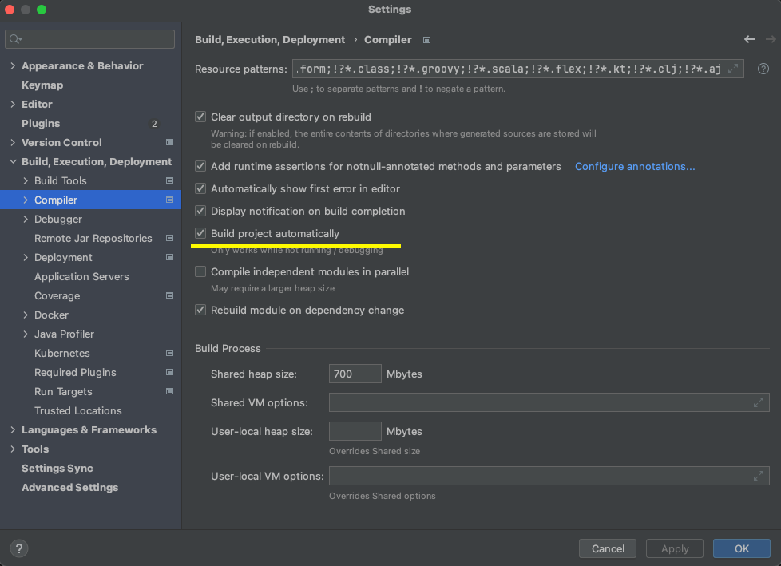
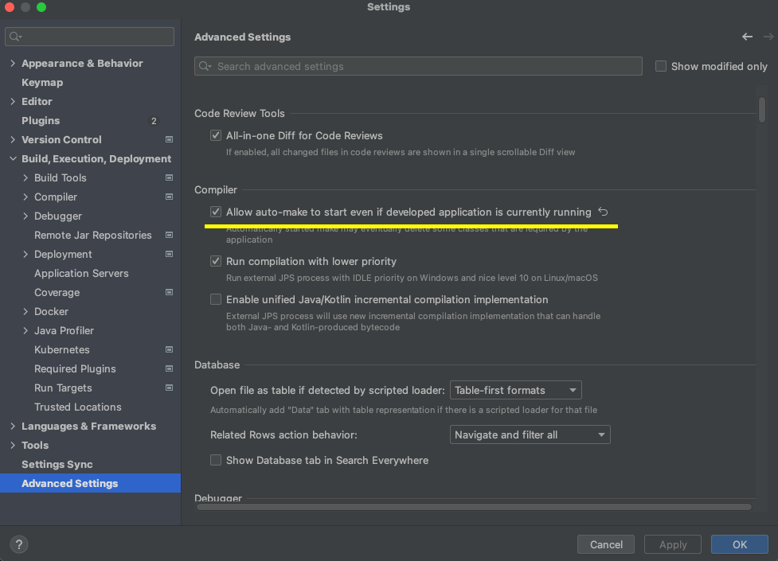

# Trabajo Practico Integrador - UNLAM

## Docker Compose
A continuación se detallan los comandos para gestionar los contenedores Docker en este proyecto:
* Descargar e instalar Docker desde https://www.docker.com/
### Servicios configurados:
* mySQL
* phpMyAdmin (aunque pueden usar DBeaver,Workbench,etc)
* Spring Boot (modo DEV)
* Angular
* InfluxDB
* Grafana
* Mosquitto serverMQTT

### Levantar los Contenedores
Levanta y construir los servicios definidos en el archivo `docker-compose.yml`:

```bash
docker-compose up --build -d
```
### Detener y Eliminar Contenedores
```bash
docker-compose down -v
docker system prune -a --volumes 
```
### Ver los contenedores activos - puertos
```bash
docker ps
```
### Spring tiene activado el modo DevTools que detecta los cambios.
####  Activar en el proyecto las siguientes opciones


#### En caso que no detecte los cambios, se puede solo recargar Spring sin necesidad de reconstrur todo el proyecto.
```bash
docker-compose restart spring-boot-app 
```
### Ver Logs de MySQL
```bash
docker-compose logs mysql
```
### Ver Logs de phpMyAdmin
```bash
docker-compose logs phpmyadmin
```
### Ver Logs de Spring Boot
```bash
docker-compose logs spring-boot-app
```
### Ver Logs de Angular
```bash
docker-compose logs angular-app
```